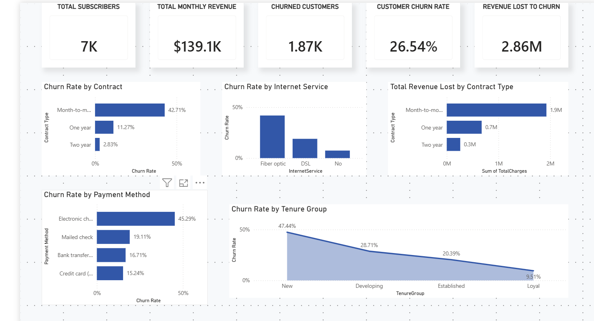
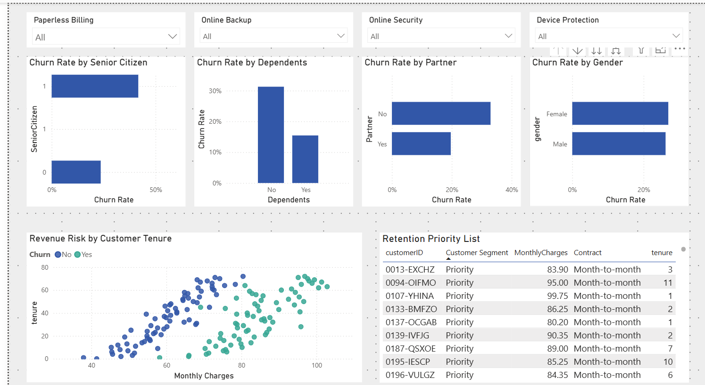
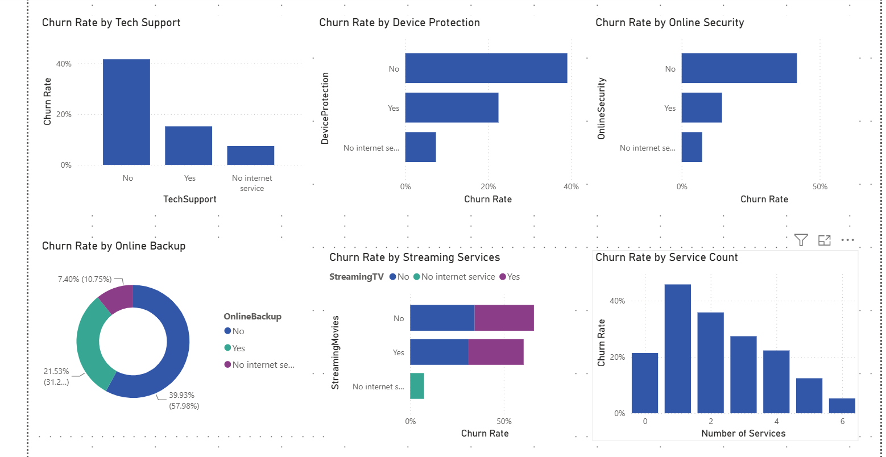
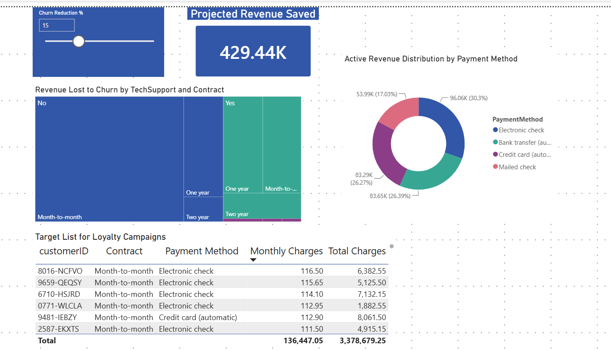

# Telecom Churn Analytics: Drivers, Risks & Retention Opportunities

## Executive Summary

Customer churn is one of the most significant challenges facing subscription-based businesses. In this project, I analyzed a telecommunications customer dataset containing 7,043 customer accounts to identify the primary drivers of churn, quantify revenue risk, and uncover actionable retention opportunities.

Using SQL for data exploration and Power BI for interactive reporting, I identified critical churn patterns across contract structures, customer lifecycles, payment methods, and service adoption behaviors. The analysis revealed an overall churn rate of **26.54%**, representing **1,869 lost customers**, while exposing high-risk customer segments that can be targeted through proactive retention strategies.

---

## Project Snapshot

| Metric                        | Value                                           |
| ----------------------------- | ----------------------------------------------- |
| Total Customers               | 7,043                                           |
| Churned Customers             | 1,869                                           |
| Overall Churn Rate            | 26.54%                                          |
| Highest-Risk Contract Type    | Month-to-Month                                  |
| Highest-Risk Payment Method   | Electronic Check                                |
| Highest-Risk Customer Cluster | Month-to-Month + Fiber Optic + Electronic Check |
| Tools Used                    | SQL, Power BI, DAX                              |

---

## Business Problem

The telecom company is experiencing significant customer attrition, resulting in recurring revenue loss and increased customer acquisition costs.

Management requires a data-driven understanding of:

* Which customers are most likely to churn
* When churn risk peaks during the customer lifecycle
* Which products and services improve retention
* How billing decisions influence customer behavior
* Which customer segments should be prioritized for intervention

The goal of this project is to transform customer data into actionable retention strategies that reduce churn and improve long-term profitability.

---

## Dataset Overview

The dataset contains **7,043 customer records** and **21 business attributes** spanning four major business domains.

### Customer Demographics

* CustomerID
* Gender
* SeniorCitizen
* Partner
* Dependents

### Customer Lifecycle

* Tenure

### Product & Service Adoption

* PhoneService
* MultipleLines
* InternetService
* OnlineSecurity
* OnlineBackup
* DeviceProtection
* TechSupport
* StreamingTV
* StreamingMovies

### Billing & Revenue

* Contract
* PaperlessBilling
* PaymentMethod
* MonthlyCharges
* TotalCharges
* Churn

---

## Tools Used

* SQL (MySQL Workbench)
* Power BI
* DAX
* Power Query

---

## Business Questions

This analysis was designed to answer the following questions:

1. Which contract types generate the highest churn rates?
2. At what stage of the customer lifecycle does churn peak?
3. Do payment methods influence customer retention?
4. Which services contribute most to customer retention?
5. What customer profiles present the highest revenue risk?
6. How can retention efforts be prioritized for maximum business impact?

---

## Methodology

### SQL Analysis

I used MySQL Workbench to:

* Audit data quality
* Validate dataset integrity
* Segment customers by churn behavior
* Identify high-risk customer groups
* Quantify revenue and retention risks

### Power BI Development

I used Power BI to:

* Build interactive dashboards
* Create custom DAX measures
* Develop customer risk segmentation
* Analyze retention behavior across multiple dimensions
* Design executive-level reporting pages

---

## Critical Business Insights

### 1. Contract Volatility Is the Largest Churn Driver

Month-to-Month customers experienced a churn rate of **42.71%** (1,655 customers), compared to:

* One-Year Contracts: **11.27%**
* Two-Year Contracts: **2.83%**

Long-term contracts significantly improve customer retention.

---

### 2. The First Year Represents the Highest Risk Period

**55.4% of all churned customers** left within their first 12 months.

Average tenure among churned customers was approximately **4 months**, highlighting onboarding and early-customer experience as major churn drivers.

---

### 3. Electronic Check Payments Create Significant Friction

Customers paying through Electronic Check exhibited a churn rate of **45.29%**.

In contrast, customers using automated payment methods maintained churn rates closer to **15–16%**.

---

### 4. Service Adoption Strengthens Retention

Customers subscribed to retention-oriented services such as:

* TechSupport
* OnlineSecurity
* DeviceProtection

demonstrated substantially lower churn rates.

The analysis suggests that customers embedded deeper within the service ecosystem become significantly less likely to leave.

---

### 5. The Toxic Trifecta Segment

The combination of:

* Month-to-Month Contract
* Fiber Optic Internet
* Electronic Check Payment

produced a churn rate of **60.37%**, making it the highest-risk customer segment identified during the analysis.

This segment represents the most immediate opportunity for retention intervention.

---

## Dashboard Architecture

### Page 1 — Executive Churn Overview

Provides a high-level view of:

* Overall churn performance
* Revenue exposure
* Customer segmentation
* Executive KPIs



---

### Page 2 — Customer Risk Analysis

Focuses on:

* Customer tenure patterns
* Revenue behavior
* Risk segmentation
* Retention priority lists



---

### Page 3 — Service Impact Analysis

Examines:

* Product adoption
* Service stickiness
* Churn reduction drivers
* Customer engagement patterns



---

### Page 4 — Revenue Optimization & Retention Simulator

An interactive decision-support page designed to help management evaluate the financial impact of churn reduction initiatives and prioritize retention investments.

Key capabilities include:

* What-If Simulation Slider
* Projected Revenue Saved KPI
* Revenue Loss Analysis
* Retention Campaign Targeting

This page transforms the dashboard from a descriptive reporting solution into a strategic planning tool by allowing decision-makers to estimate the financial impact of retention initiatives before implementation.



---

## Strategic Recommendations

### 1. Stabilize High-Risk Fiber Customers

Bundle TechSupport and OnlineSecurity incentives into new Fiber Optic subscriptions to increase perceived value and switching costs.

### 2. Promote Auto-Pay Adoption

Offer targeted incentives encouraging Electronic Check users to migrate to automated payment methods.

### 3. Improve First-Year Customer Success

Launch proactive onboarding campaigns during the first 3–6 months of the customer lifecycle to reduce early-stage attrition.

### 4. Encourage Long-Term Contracts

Provide incentives for Month-to-Month customers willing to transition to annual subscription agreements.

---

## Business Impact

This analysis enables retention teams to focus resources on the customers most likely to leave rather than applying broad retention campaigns across the entire customer base.

By targeting the identified high-risk segments, the organization can:

* Reduce customer acquisition replacement costs
* Improve customer lifetime value (CLV)
* Increase recurring revenue stability
* Optimize retention spending
* Strengthen long-term profitability

---

## Repository Structure

```text
telecom-churn-analytics
│
├── README.md
├── telecom_churn_queries.sql
├── Telecom_Churn_Dashboard.pbix
│
└── images
    ├── dashboard_page1.png
    ├── dashboard_page2.png
    ├── dashboard_page3.png
    └── dashboard_page4.png
```

## Repository Files

* README.md — Project documentation and business case study
* telecom_churn_queries.sql — Complete SQL analysis script
* Telecom_Churn_Dashboard.pbix — Interactive Power BI dashboard
* images/ — Dashboard screenshots used throughout the documentation
